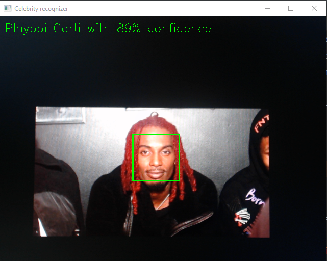

# CelebDetector
A program that you can train to reconginze faces through webcams, videos, or images and type out there names using OpenCV

# What I learned 
- Basic Machine learning
- How to use OpenCV 
- Reading and working with different media files
- 

